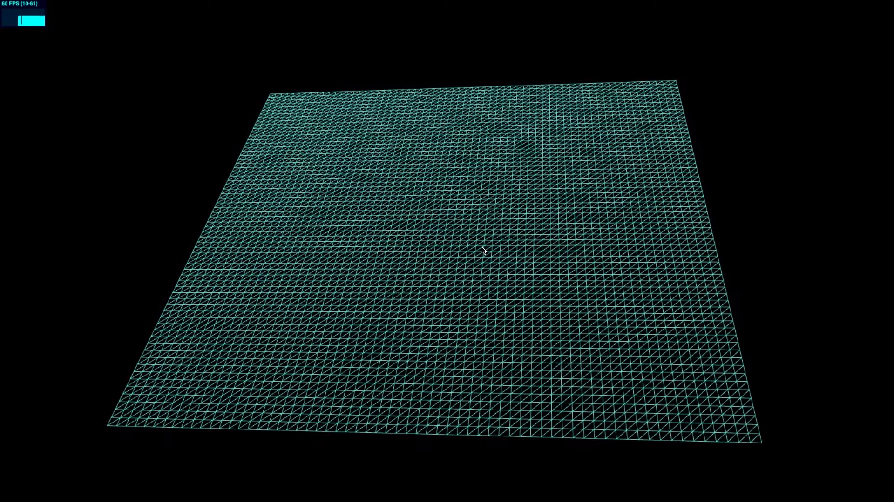
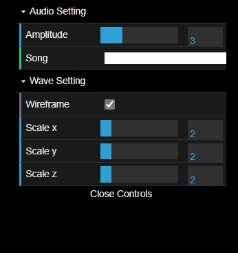

<h1>3D Audio Waveform Visualizer with JavaScript + Three.js</h1>

<h2>Table of Content</h2>

- [1. Ý tưởng](#1-ý-tưởng)
- [2. Giải thích bước làm](#2-giải-thích-bước-làm)
  - [2.1. Tạo project](#21-tạo-project)
  - [2.2. Cài đặt Thư viện](#22-cài-đặt-thư-viện)
  - [2.3. Khởi tạo Scene, Camera và Light](#23-khởi-tạo-scene-camera-và-light)
  - [2.4. Tạo đối tượng 3D có hình dạng bất kì](#24-tạo-đối-tượng-3d-có-hình-dạng-bất-kì)
  - [2.5. Kết nối API Âm thanh với Web](#25-kết-nối-api-âm-thanh-với-web)
  - [2.6. Tạo hiệu ứng sóng nhạc](#26-tạo-hiệu-ứng-sóng-nhạc)
    - [2.6.1. vertexShader](#261-vertexshader)
    - [2.6.2. fragmentShader](#262-fragmentshader)
  - [2.7. Tạo dat.GUI](#27-tạo-datgui)
- [3. Cách chạy trên máy của bạn](#3-cách-chạy-trên-máy-của-bạn)
  - [3.1. Yêu cầu](#31-yêu-cầu)
  - [3.2. Cài đặt](#32-cài-đặt)
  - [3.3. Chạy](#33-chạy)
- [4. Tài liệu tham khảo](#4-tài-liệu-tham-khảo)

## 1. Ý tưởng

Với mục tiêu là tạo ra sóng nhảy theo nhạc, ý tưởng ban đầu chính là sử dụng dữ liệu tần số âm thanh sử dụng làm tham số truyền vào `uniforms` trong shader, từ đó tạo ra hiệu ứng sóng âm dựa trên `amplitude` của các tần số âm thanh.

Trong khi việc lấy dữ liệu tần số âm thanh được thực hiện khá đơn giản bằng cách sử dụng `Web Audio API` với `AudioContext` và `AnalyserNode` nhưng việc tạo ra hiệu ứng sóng âm thì lại có phần khó khăn hơn.

Về khái niệm `uniforms` trong `shader`, chúng ta có thể hiểu đơn giản là các đại diện cho dữ liệu có thể thay đổi trong quá trình chạy shader ví dụ như thời gian, màu sắc, biên độ và các thông số khác. Khi thay đổi những giá trị này với dữ liệu từ âm thanh lấy được ở trên, chúng ta có thể tạo ra hiệu ứng sóng âm.
First, run the development server:

## 2. Giải thích bước làm

### 2.1. Tạo project

Cho dù rằng trong Docs của ThreeJS có hướng dẫn cách thiết lập khi tạo mới 1 Dự án với HMTL, CSS và JS nhưng trong bài này chúng ta sẽ thiếp lập ThreeJS với Next.js cùng Tailwind CSS giúp hỗ trợ tạo ra những mô hình 3D thú vị và phức tạp hơn mà chỉ JS và CSS không thể làm được.

```bash
npx create-next-app@latest
```

Sau đó bạn sẽ được yêu cầu nhập tên dự án và một số thông tin khác. Sau khi tạo xong bạn sẽ được nhận 1 dự án NextJS ví dụ hoàn chỉnh.

### 2.2. Cài đặt Thư viện

Các thư viện cần dùng bạn có thể xem trong file `package.json`. Sử dụng `npm` để cài đặt chúng

```bash
npm install three dat.gui
```

### 2.3. Khởi tạo Scene, Camera và Light

Đây là 3 thành phần cơ bản nhất tạo nên một môi trường 3D. Trong đó:

Scene:

```js
this.scene = new THREE.Scene();
```

Camera:

```js
this.camera = new THREE.PerspectiveCamera(
	this.fov, // góc nhìn
	window.innerWidth / window.innerHeight, // tỉ lệ khung hình
	1, // gần nhất
	1000 // xa nhất
);
this.camera.position.z = 196;
```

Light:

```js
let ambientLight = new THREE.AmbientLight(0xffffff, 0.7);
ambientLight.castShadow = false;
this.scene.add(ambientLight);

let spotLight = new THREE.SpotLight(0xffffff, 0.55);
spotLight.castShadow = true;
spotLight.position.set(0, 80, 10);
this.scene.add(spotLight);
```

### 2.4. Tạo đối tượng 3D có hình dạng bất kì

Đối tượng sóng nhạc có hình dạng như thế nào sẽ được quyết định ở bước này.
Ví dụ nếu như ta tạo một đối tượng như sau:

```js
const planeGeometry = new THREE.PlaneGeometry(100, 100, 100, 100);
const planeCustomMaterial = new THREE.MeshNrmaMaterial({
	wireframe: true,
});
const planeMesh = new THREE.Mesh(planeGeometry, planeCustomMaterial);
planeMesh.rotation.x = -Math.PI / 4;
planeMesh.scale.x = 2;
planeMesh.scale.y = 2;
planeMesh.scale.z = 2;
planeMesh.position.y = 8;
test.scene.add(planeMesh);
```

Thêm nó vào Sence và ta sẽ có được màn hình như sau:



### 2.5. Kết nối API Âm thanh với Web

Bước tiếp theo chúng ta cần thêm file âm thanh vào trang web để có thể lấy dữ liệu về tần số

```js
<div className="flex flex-col items-center justify-center">
	<div className="absolute bottom-2 right-2">
		<audio
			id="myAudio"
			src="./a-long-legend-study.mp3" // Đường dẫn đến file audio mặc định khi load trang
			className="w-80"
			controls
			autoPlay
			onPlay={play}
		/>
	</div>
</div>
```

Về cơ bản thì chúng ta sẽ sử dụng `Web Audio API` để lấy dữ liệu về tần số âm thanh. Để làm được điều này chúng ta cần tạo ra 1 `AudioContext` và 1 `AnalyserNode` để lấy dữ liệu về tần số âm thanh. Những dữ liệu này được lưu vào mảng `Uint8Array` và được cập nhật liên tục trong quá trình chạy.

```js
const setupAudioContext = () => {
	audioContext = new window.AudioContext();
	audioElement = document.getElementById("myAudio");
	source = audioContext.createMediaElementSource(audioElement);
	analyser = audioContext.createAnalyser();
	source.connect(analyser);
	analyser.connect(audioContext.destination);
	analyser.fftSize = 1024;
	dataArray = new Uint8Array(analyser.frequencyBinCount);
};
```

Trong đó `fftSize`là kích thước của bộ xử lý Fourier (Fast Fourier Transform - FFT) được sử dụng để phân tích tín hiệu âm thanh. Giá trị 1024 xác định rằng FFT sẽ được áp dụng cho 1024 mẫu âm thanh.

Giá trị 1024 cho `fftSize` là một giá trị phổ biến và thường được sử dụng trong các ứng dụng âm nhạc và hiệu ứng âm thanh. Nó cung cấp một sự kết hợp tốt giữa độ chi tiết của phân tích tần số và hiệu suất tính toán.

Nếu tăng giá trị này lên, kết quả là bạn sẽ có một phân tích tần số chi tiết hơn và độ phân giải tần số cao hơn. Tuy nhiên, điều này cũng đồng nghĩa với việc tăng tải xử lý và bộ nhớ yêu cầu để tính toán và lưu trữ dữ liệu biên độ tần số.

Như vậy tùy thuộc vào yêu cầu và mục đích sử dụng, chúng ta cần cân nhắc giữa độ chi tiết và độ phân giải tần số với hiệu suất và tài nguyên hệ thống khi lựa chọn giá trị `fftSize`.

Những dữ liệu này sẽ được lưu vào mảng `dataArray` và được cập nhật liên tục trong quá trình chạy và gọi hàm `render` mỗi khung hình chuyển động sử dụng dữ liệu mới nhất.

```js
const render = (time) => {
	// Cập nhật dữ liệu từ audio vào mảng dataArray
	analyser.getByteFrequencyData(dataArray);
};
```

Mảng này là một mảng kiểu dữ liệu không dấu 8-bit, được sử dụng để lưu trữ các giá trị của biên độ tần số của tín hiệu âm thanh. Thông thường giá trị của mảng dataArray nằm trong khoảng từ 0 đến 255 (hoặc 0 đến 1 khi sử dụng `analyser.getFloatFrequencyData(dataArray)`). Giá trị này thể hiện biên độ của tần số tương ứng, trong đó 0 đại diện cho biên độ thấp nhất và 255 (hoặc 1) đại diện cho biên độ cao nhất.

Sử dụng `console.log(dataArray)` để xem dữ liệu trong mảng này trong lúc chạy ta có được các kết quả như sau tức là đã phân tích và có được dữ liệu về tần số âm thanh thành công.


### 2.6. Tạo hiệu ứng sóng nhạc

Khi đã có được dữ liệu về tần số âm thanh, giờ là lúc ta sử dụng nó đưa vào mặt phẳng đã tạo từ nãy. Để làm được như này ta cần thực hiện sử dụng `ShaderMaterial` - thứ mà sẽ cho phép chúng ta kiểm soát vị trí các đỉnh trên đối tượng 3D cũng như màu sắc của chúng thay vì `MeshNrmaMaterial` như ban đầu ta đã sử dụng.

```js
const planeCustomMaterial = new THREE.ShaderMaterial({
	uniforms: uniforms, // Đối tượng chứa các biến được truyền vào shader (dataArray, time)
	vertexShader: vertexShader(),
	fragmentShader: fragmentShader(),
	wireframe: true,
});
```

2 hàm `vertexShader` và `fragmentShader` sẽ là hàm quyết định sóng nhạc sẽ được hiển thị như thế nào. Để hiểu rõ hơn về cách thức hoạt động của 2 hàm này ta sẽ đi vào phân tích từng hàm. Cả 2 được viết bằng `glsl` (graphic library shader language), về cơ bản có cú pháp gần giống như C. Tuy nhiên ta cũng không cần phải quá lo lắng về cú pháp vì thứ ta cần quan tâm là một vài biến quan trọng mà ta sử dụng ở dưới đây.

#### 2.6.1. vertexShader

```c
void main() {
	// mặc định
	gl_Position = projectionMatrix * modelViewMatrix * vec4(position.x, position.y, position.z, 1.0);
}
```

`gl_Position` là biến quyết định vị trí của đỉnh trong không gian 3 chiều. Theo mặc định giá trị này được tính bằng tích của 2 ma trận `projectionMatrix` và `modelViewMatrix` với vị trí của đỉnh được truyền vào qua biến `position`. Như vậy, chỉ cần thay đổi giá trị của `z` kia theo các giá trị trong mảng `dataArray` là ta có thể thay đổi vị trí của đỉnh tạo hiệu ứng sóng nhạc, trong khi `x` và `y` được giữ nguyên để đảm bảo đối tượng không di chuyển đi đâu hết.

```c
varying float x;
varying float y;
varying float z;
varying vec3 vUv;

uniform float u_time;
uniform float u_amplitude;
uniform float[64] u_data_arr;

void main() {
	vUv = position;

	x = abs(position.x);
	y = abs(position.y);

	float floor_x = round(x);
	float floor_y = round(y);

	float index = floor_x + floor_y * 32.0;

	z = sin(u_data_arr[int(floor_x)] / 50.0 + u_data_arr[int(floor_y)] / 50.0) * u_amplitude;

	gl_Position = projectionMatrix * modelViewMatrix * vec4(position.x, position.y, z, 1.0);
}
```

Vì các vị trí của các đỉnh trong không gian có tọa độ (x, y) có thể là các số thực, ta cần làm tròn cũng như lấy trị tuyệt đối để có được số vị trí hợp lệ trong mảng `dataArray`. Bằng cách này, sóng nhạc sẽ có sự đối xứng qua trục `x` và `y` và sẽ không bị lệch đi một phía nào cả.

Giá trị z có thể được tính theo nhiều cách khác nhau không nhất thiết phải là biểu thức như ở trên, quan trọng rằng các giá trị mà nó sử dụng được lấy từ mảng `dataArray` thì sóng nhạc sẽ có sự chân thực và đồng bộ với bài hát.

#### 2.6.2. fragmentShader

Trong khi `vertexShader` quyết định vị trí của các đỉnh thì `fragmentShader` quyết định màu sắc của các đỉnh đó. Để đơn giản ta sẽ sử dụng màu đen cho các đỉnh và được quyết định qua biến `gl_FragColor`.

```c
void main() {
	gl_FragColor = vec4(1.0, 0.0, 0.0, 1.0); // màu đỏ
}
```

Bằng việc sử dụng if else ta có thể thay đổi màu sắc của các đỉnh theo ý muốn. Ví dụ như điều kiện ở đây phụ thuộc vào vị trí `x` của các đỉnh:

```c
void main() {
	if (x < 0.5) {
		gl_FragColor = vec4(1.0, 0.0, 0.0, 1.0); // màu đỏ
	} else {
		gl_FragColor = vec4(0.0, 1.0, 0.0, 1.0); // màu xanh
	}
}
```

Hay ta có thể sử dụng kèm biến thời gian `u_time` để tạo hiệu ứng chớp tắt:

```c
void main() {
	if (sin(u_time) > 0.0) {
		gl_FragColor = vec4(1.0, 0.0, 0.0, 1.0); // màu đỏ
	} else {
		gl_FragColor = vec4(0.0, 1.0, 0.0, 1.0); // màu xanh
	}
}
```

```c
varying float x;
varying float y;

void main() {
	gl_FragColor = vec4((40.0 - abs(x)) / 40.0, (40.0 - abs(y)) / 40.0, (abs(x + y) / 2.0) / 40.0, 1.0);
}
```

Bằng việc thay đổi giá trị `40.0` kia, ta sẽ có được mô hình với phần trăm của các màu là khác nhau.

Cuối cùng ta sẽ có được mô hình sóng nhạc như sau:


### 2.7. Tạo dat.GUI

Để tạo ra giao diện điều khiển cho mô hình, ta sử dụng thư viện `dat.GUI` của `three.js`. Chúng ta sẽ chọn các biến cần điều khiển và tạo ra các điều khiển tương ứng với chúng. Trong dự án này, chúng ta sẽ tạo ra 2 điều khiển cho Bài hát và cho sóng nhạc và có được kết quả như sau:



Ta có thể điều chỉnh:

- Amplitude: Giá trị càng cao thì sóng nhạc càng cao.
- Song: Chọn bài hát
- Wireframe: Chọn xem sóng nhạc dưới dạng wireframe hay không.
- Scale x/y/z: Phóng to hoặc thu nhỏ sóng nhạc theo trục x, y, z.

## 3. Cách chạy trên máy của bạn

### 3.1. Yêu cầu

- Node.js
- NPM

### 3.2. Cài đặt

```bash
git clone https://github.com/kztera/audio-waveform-visualizer.git
cd audio-waveform-visualizer
npm install
```

### 3.3. Chạy

```bash
npm run dev
```

## 4. Tài liệu tham khảo

- [Coding a 3D Audio Waveform Visualizer with JavaScript + Three.js](https://youtu.be/tQL1VLTJTnc)
- [SuboptimalEng/gamedex/04-audio-visualizer](https://github.com/SuboptimalEng/gamedex/tree/main/04-audio-visualizer) by [@SuboptimalEng](https://github.com/SuboptimalEng)
